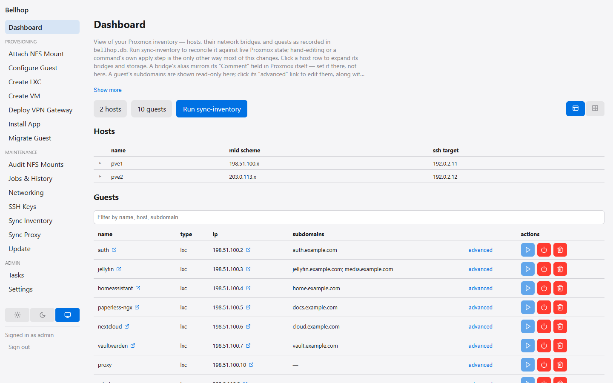

# Bellhop

A self-hosted app store for your Proxmox VE homelab. Bellhop installs
appliances from [community-scripts](https://github.com/community-scripts/ProxmoxVE)
into new LXC containers, then handles what comes after: inventory,
reverse-proxy routes (Caddy, nginx, Nginx Proxy Manager, HAProxy, or
Traefik, through a pluggable driver — see [Reverse proxy
drivers](docs/reverse-proxy/README.md)), Authentik login
gating, updates, and migrations between hosts. It ships as a web UI, a
CLI, and an MCP server, and reaches your Proxmox hosts over SSH from your
local machine.

Bellhop is an independent project, not affiliated with or endorsed by
Proxmox Server Solutions GmbH. Proxmox is a registered trademark of
Proxmox Server Solutions GmbH.



## Prerequisites

- [Node.js](https://nodejs.org/) >= 24
- SSH access to your Proxmox hosts. The setup walkthrough gives Bellhop
  its own key and installs it on each host for you, using the host's root
  password once or a line you paste into `authorized_keys` yourself. A
  host without its own key file falls back to a default identity file
  (`~/.ssh/id_ed25519`, `id_ecdsa`, or `id_rsa`, first match wins), and
  only then to an SSH agent (Pageant on Windows).
- `npm`

## Setup

```bash
npm install
npm link   # exposes the `bellhop` command globally; optional, you can
           # also always run `npm run bellhop -- <command> ...` instead
```

`npm install` also installs `web-client/`'s dependencies (an npm workspace
of this package) — no separate install step is needed to run `npm run
web:dev`/`web:build`.

Then build and start the web UI on port 3001:

```bash
npm run web:build
npm run web:start
```

On a fresh install (no inventory yet) the service log prints a one-time
setup address:

```text
Setup is pending: open http://localhost:3001/setup?token=<token> ...
```

Open it (from another device, use this machine's address instead of
`localhost`). The setup walkthrough installs Bellhop's SSH key on your
first Proxmox host, discovers the host's cluster, bridges, storage and
guests, and sets your domain and other inventory-wide values. Until it
finishes, the rest of the web UI is unavailable. See
[First-run setup](docs/setup.md) for each step.

After setup, `sync-inventory` pulls in guests created outside Bellhop — a
dry run first, then `--apply` to write them:

```bash
npm run bellhop -- sync-inventory
npm run bellhop -- sync-inventory --apply
```

The Settings page and `set-config` change any inventory-wide value later.
See [Configuration](docs/configuration.md) for the full list and what
happens when a value stays unset, and [Web UI](docs/web-ui.md) for the
development server, authentication, and what each page does. To see the
web UI without any of the above, run `npm run demo` instead — a throwaway
instance with built-in example data.

## Commands

All commands are run as `bellhop <command> [flags]` (after `npm link`)
or `npm run bellhop -- <command> [flags]`. Anything that changes
infrastructure or the inventory prints a dry run by default and only acts
with `--apply`. The main ones:

| Command | What it does |
|---|---|
| `sync-inventory` | Reconcile the inventory's guests with what each Proxmox host actually runs |
| `install-app` | Create a new LXC from a community-scripts app installer |
| `update-app` | Re-run an app's installer inside its guest to update it |
| `check-app-updates` | Check whether a newer release exists for each LXC app guest |
| `update-all` | Update OS packages on hosts and LXC guests |
| `create-lxc` / `create-vm` | Create a bare container or VM from a Machine ID |
| `configure-guest` | Install packages or an SSH key on a guest |
| `guest-power` | Start or shut down a guest |
| `migrate-guest` | Move a guest to another Proxmox host |
| `delete-guest` | Stop, optionally back up, and destroy a guest |
| `attach-nfs-mount` | Give an existing guest a NAS share through its host |
| `sync-proxy` | Write the reverse-proxy configuration and reload the proxy |
| `sync-authentik` | Reconcile Authentik applications, OpenID clients, and access tiers |
| `configure-web-login` | Store the sign-in client Bellhop's own web UI uses |
| `set-config` | Set an inventory-wide setting |

[Commands](docs/commands.md) has every command, its flags, and how each one
behaves.

## Documentation

- [First-run setup](docs/setup.md) — the walkthrough a fresh install starts
  with, and its setup token.
- [Commands](docs/commands.md) — every command, with examples.
- [Configuration](docs/configuration.md) — the inventory file, inventory-wide
  settings, integration settings and secrets, and installing apps from your
  own script repository.
- [Environment variables](docs/environment-variables.md) — overrides and
  the environment-only variables.
- [Web UI](docs/web-ui.md) — running the dashboard and how it authenticates.
- [Permissions](docs/permissions.md) — per-group allow-lists/block-lists and
  a guest creator's automatic access to it.
- [MCP server](docs/mcp-server.md) — Bellhop's operations as tools for an AI
  assistant, locally over stdio or remotely over HTTPS with sign-in.
- [Authentik](docs/authentik.md) — running without it, and gating apps
  through OpenID Connect (OIDC mode).
- [Proxmox access for VM creators](docs/proxmox-access.md) — granting a
  web UI VM creator access to it in Proxmox, and how migration keeps it.
- [Reverse proxy drivers](docs/reverse-proxy/README.md) — how `sync-proxy`
  manages a proxy, with a page per driver: [Caddy](docs/reverse-proxy/caddy.md),
  [Caddy (admin API)](docs/reverse-proxy/caddy-api.md),
  [nginx](docs/reverse-proxy/nginx.md), [Nginx Proxy
  Manager](docs/reverse-proxy/nginx-proxy-manager.md),
  [HAProxy](docs/reverse-proxy/haproxy.md), and
  [Traefik](docs/reverse-proxy/traefik.md).
- [Troubleshooting](docs/troubleshooting.md) — running the checks, and known
  hardware issues.
- `CLAUDE.md` — the root orientation file (commands, architecture map,
  cross-cutting rules, workflow); nested `CLAUDE.md` files in `src/…` and
  `web-client/` hold subsystem detail.

## Contributing

Contributions are welcome. [`CONTRIBUTING.md`](./CONTRIBUTING.md) covers
setting up a working copy without any real Proxmox infrastructure, how
changes are tested, and the example-data-only rule every change must
follow. Participation is governed by the
[code of conduct](./CODE_OF_CONDUCT.md).

## Security

To report a vulnerability, see [`SECURITY.md`](./SECURITY.md).

## License

MIT — see [`LICENSE`](./LICENSE).
