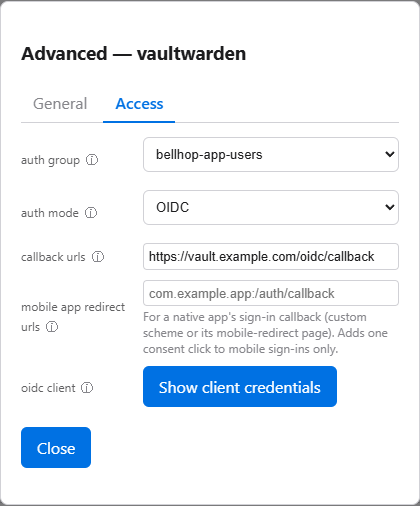

# Authentik

Bellhop can gate the web UI and your apps behind a self-hosted Authentik instance. This page covers running without it, and gating an app through Authentik's own OpenID Connect clients (OIDC mode).

## Running without Authentik

Authentik is optional. With no `data/authentik.env` and no
`WEB_UI_AUTH_MODE` set, the web UI runs in `auto` mode: every request is
served as a single always-admin local operator, and the features that need
Authentik's REST API disable themselves — the Users and Permissions pages
disappear from the nav, `POST /api/impersonate` returns 503, and
`sync-authentik` is skipped by the Dashboard's push-live step instead of
failing it. The Settings page stays in the nav and reachable, since it
needs no Authentik. Everything else — the Dashboard, provisioning,
maintenance, jobs, `sync-proxy`, and every CLI command — works unchanged.

A persistent banner in the UI and a warning line in the server's startup
log both say so, because in this mode **network reach is the only access
control**: anyone who can connect to the port gets full provisioning
rights. The Windows firewall rule this repo installs (scoped to the
`proxy: true` entry's IP) is what keeps that boundary meaningful.

To add authentication later, set up Authentik forward-auth in Caddy (see
[Web UI](web-ui.md)), create `data/authentik.env`, and set
`WEB_UI_AUTH_MODE=authentik` so a broken `forward_auth` directive fails
closed rather than silently reverting to the local operator.

## OIDC mode

A gated entry (one with `authGroup` set) is enforced one of two ways,
chosen per entry with `authMode`: `forward` (the default, and the only
option before this feature existed) puts the active proxy driver's
forward-auth in front of it (Caddy's `forward_auth`, or the equivalent
`auth_request` block on the nginx driver), checking every request against
Authentik and forwarding a shared,
already-authenticated identity in `X-authentik-*` headers; `oidc` instead
gives the entry its own Authentik OpenID Connect client and lets the app
run its own login. A driver that can't enforce a mode an entry needs is
refused at sync and edit time rather than silently leaving that entry
ungated — see [Reverse proxy drivers](reverse-proxy/README.md).

Choose `oidc` for an app that already has its own user accounts, roles, or
permissions and can tell users apart on its own — forward-auth otherwise
hides every visitor behind the same trusted headers, so the app sees one
shared identity rather than each person's own account. Keep `forward` (the
default) for an app with no login of its own, which is most gated apps in
a typical inventory.

To switch an entry to OIDC mode: set `authGroup` (its access tier, same as
today), `authMode: oidc`, and `oidcRedirectUris` (the app's own callback
URL — an absolute `http://`/`https://` address, e.g.
`https://media.example.com/auth/callback`, whatever the app's own OIDC/
OpenID settings call for; more than one is allowed). For a guest, use the
Dashboard's Advanced modal (admin only) — its General/Access tabs, see
"Access tab" below; the callback/mobile-redirect fields live on Access.
Its fields each save on their own,
and a save that would leave an entry in OIDC mode with an access tier but
no callback URL is rejected, so go in this order: set the access tier, save
the Callback URLs, and only then switch Auth mode to OIDC. A host or
external site is DB/CLI-only, the same as `authGroup` itself. Then run
`bellhop sync-authentik --apply` (or save the Dashboard edit, which runs
the same sync as part of its push-live step) to create the OpenID client
in Authentik.

**Mobile app redirect URLs.** An OIDC-mode entry also accepts an optional
`oidcMobileRedirectUris` list, alongside `oidcRedirectUris`, for a native
mobile app's own sign-in callback — either a custom-scheme URI (e.g.
`app.example:///oauth-callback`) or an `https://` hand-off page the app
opens from (e.g. `https://books.example.com/auth/openid/mobile-redirect`).
Use it when the app has an Android/iOS client that signs in through the
phone's browser and gets handed back to the app; a plain browser-only login
never needs it. Any scheme is accepted except `javascript:`, `data:`,
`file:` and `vbscript:` (any letter case), which are rejected with a
message naming the rejected value. A URI must not appear in both the
callback list and the mobile list of the same entry — the edit is rejected,
naming the duplicate, though this is only checked when the entry is edited,
never when a saved inventory is loaded. `sync-authentik` sets the OpenID
client's allowed callbacks to the callback list plus the mobile list
together (deduplicated); a change to only the mobile list is reported the
same as a callback-list change and never rotates the client's credentials.
Set it through the Dashboard's Advanced modal (Access tab, admin only,
same rule as the callback URLs), the MCP server's `edit_guest` tool, or
YAML import — there is no CLI edit command for it.

**The mobile consent step.** Once any entry anywhere in the inventory has
a mobile redirect URL in effect, `sync-authentik` also adds a one-click
consent step to the shared authorization flow, scoped to exactly those
URLs: a consent stage named `bellhop-mobile-app-consent`, a binding of it
to the flow, an expression policy named
`bellhop-consent-on-mobile-redirect`, and a binding of that policy to the
stage binding. The policy passes — showing the consent page — only when
the login's own redirect URI exactly matches one of the mobile URLs
currently in effect across the whole inventory; every other login
(browser, or a mobile URL that isn't configured) skips it automatically,
with zero clicks. This fixes a real Android quirk: with an existing
Authentik session, the default authorization flow is nothing but automatic
redirects, and the in-app browser tab can refuse to hand off to the app
when there was no user gesture in the chain — one "Continue" click before
the hand-off is enough to satisfy it. Any error while the policy is
evaluated (an Authentik quirk, an unreachable dependency) means "no
consent page," the same as it not matching — a browser login is never
blocked by it. The four objects are created only while at least one
mobile URL is in effect anywhere; removing the last one is what removes
all four again on the next sync, leaving nothing behind. Bellhop only ever
touches objects it recognizes as its own (a consent stage/expression
policy under those exact names, the policy also carrying a comment marker
identifying it as Bellhop-managed) — a same-named object it didn't create
is reported as a conflict and left untouched, and the rest of the sync
still completes. After creating or changing the stage binding or the
policy, `sync-authentik` clears Authentik's cached flow plans, so a login
already in progress under the old configuration isn't served a stale plan.
**If you already have a hand-made consent stage and policy on this same
flow (under different names) from working around this yourself, delete
them once Bellhop's copy is in place** — otherwise a mobile sign-in shows
two consent pages back to back.

The consent step is bound only to the flow `AUTHENTIK_AUTHORIZATION_FLOW_SLUG`
names. An OpenID client that uses a different authorization flow (one
adopted with `adopt-oidc-client` that was set up with its own flow, say)
still gets its mobile URLs in its allowed callbacks, but no consent step.
`adopt-oidc-client` itself writes the client's callbacks (web and mobile)
but does not reconcile the consent step; the next `sync-authentik` run, or
any Dashboard guest edit, creates it. When a Dashboard save changes an
entry's mobile redirect URLs and the consent step then reports a conflict
or an error, the save still succeeds and the problem is shown as a warning
under that field (and returned by the MCP `edit_guest` tool).

A Dashboard save pushes the proxy configuration change *before* the Authentik sync runs,
so switching an entry to OIDC removes its `forward_auth` gate first. If the
sync then skips the entry (a missing signing key, say) or fails, the app is
reachable with no gate in front of it until the next successful sync — read
the warnings on the save result, and fix whatever they name before relying
on the app's own login. Reveal the entry's credentials from its Advanced modal
(admin only), or run `bellhop oidc-credentials <name>`, to get the issuer
address, client ID, and client secret — paste all three into the app's own
OIDC settings. The secret is never stored anywhere in this toolkit; both
surfaces read it fresh from Authentik every time. The MCP server's
`get_oidc_client` tool returns the issuer and client ID only, never the
secret — its response points at the Dashboard or `oidc-credentials`
instead.

**Account linking is the operator's job, not this toolkit's.** The first
sign-in through a new OIDC client creates a brand-new account in the app
(most OIDC-capable apps do this automatically), with no link to any
account that already existed there under a different login method. To
keep a user on their existing app account, let their first OIDC login
create the new one, then use the app's own account-linking/merge feature
(or delete the duplicate and reassign its data) to move them onto the
account you want them using — Bellhop has no part in that step.

Switching an entry from OIDC back to forward-auth, or clearing its access
tier while in OIDC mode, deletes its OpenID client on the next sync — the
app's existing login stops working until new credentials are entered in it.
The Dashboard asks for confirmation, naming the app, before saving that
kind of edit; the MCP server's `edit_guest` tool rejects the same edit
unless the call passes `confirmOidcClientDeletion: true`. Switching the
other way, from forward-auth to OIDC, deletes only the entry's forward-auth
Proxy Provider (there is no OpenID client yet to lose), so it needs no
confirmation. Either way the Application itself, and so its access-tier
bindings, is kept. Changing
`authMode` or `oidcRedirectUris` is admin-only in both directions on every
front end (unlike an access tier, which a non-admin may raise but not
lower), since switching to OIDC removes the forward-auth gate and the
callback URL decides where Authentik sends a signed-in user's tokens.

If an entry's address already has a hand-made OpenID client in Authentik
(one set up by hand before pointing this toolkit at it), the sync reports
a conflict rather than touching it. Run `bellhop adopt-oidc-client <name>
--apply` (dry run without `--apply`) to bring it under Bellhop's
management — its client ID and secret never change, so the app's existing
login configuration keeps working.

**Custom scope mappings.** A new OpenID client gets Authentik's three
built-in scope mappings, for `openid`, `profile` and `email`. On an existing
client (a routine sync, or adoption), Bellhop checks those scopes by *scope
name*: each one needs some attached mapping with that scope name, built-in
or your own. A custom mapping is therefore kept. The typical case is a
custom `email` mapping that sets `email_verified`, since Authentik's
built-in one always reports it as false and some apps refuse unverified
sign-ins. Mappings for other scopes are left alone too. Only a required
scope with no mapping at all counts as drift, and the fix adds the built-in
mapping for it while keeping everything already attached. The flip side:
if someone swaps a built-in mapping for another mapping with the same scope
name, Bellhop no longer puts the built-in one back. If a client has a
mapping attached that the API token cannot read, Bellhop can't tell which
scope it covers, so it leaves that client's mappings alone entirely rather
than risk adding a second mapping for a scope it already covers. One
exception to keeping custom mappings: when the sync reuses a leftover,
unused OpenID client named after the entry (one left behind by an earlier
failed run, or made by hand), it resets that client to exactly the three
built-in mappings, the same as a brand-new client.

**Authentik API token permissions.** OIDC mode needs a few more scopes on
the token in `data/authentik.env` than forward-auth-only gating did: read
and write on OAuth2/OpenID Providers (not just Proxy Providers), read on
certificate-keypairs (to resolve the signing key), read on property/scope
mappings, and update on Applications. `sync-authentik` lists OAuth2
Providers on every run. When no entry is in OIDC mode, a token that cannot
read them is tolerated — the sync carries on as forward-auth-only gating
always did — but once any entry is in OIDC mode, a token missing these
scopes fails the whole sync, not just the OIDC part of it. Once any *mobile*
redirect URL is set anywhere in the inventory, the token additionally needs
read/write on consent stages, flow-stage bindings, expression policies and
policy bindings, plus permission to clear the flow cache — the mobile
consent step above. As with the OIDC scopes, this is only ever checked
against a token that actually has a mobile URL to reconcile: a deployment
with no mobile URLs set never needs these and a token missing them causes
no failure, since there is nothing to read or write yet.

**Access tab.** The guest Advanced modal splits its fields across two tabs:
General (type, IP, host, VMID, subdomains, port, read-only proxy, insecure
backend TLS, VPN, app) and Access (auth group, auth mode, and whichever
fields apply to the selected auth mode — unauthenticated paths in forward
mode; callback URLs, mobile app redirect URLs, and OIDC client
issuer/client ID/secret in OIDC mode). A gated forward-mode guest with no
callback URL yet also shows the callback URLs field, noted "Needed before
switching auth mode to OIDC.", since that switch is refused until one is
set. Switching Auth mode back and forth
never loses a hidden field's saved value — it's simply not shown while the
other mode is selected.

**Signing key.** A new OpenID client signs its identity tokens with the
Authentik certificate-keypair named `AUTHENTIK_OIDC_SIGNING_KEY_NAME`
(default: `authentik Self-signed Certificate`, the self-signed cert every
stock Authentik install already has — see [Environment
variables](environment-variables.md)). This default is a single-operator convenience, not a
security recommendation for every deployment; override it if you've set
up your own signing key, or renamed/removed the default certificate. A
missing key fails every OIDC entry's sync with a named error; forward-auth
entries in the same run are unaffected.
