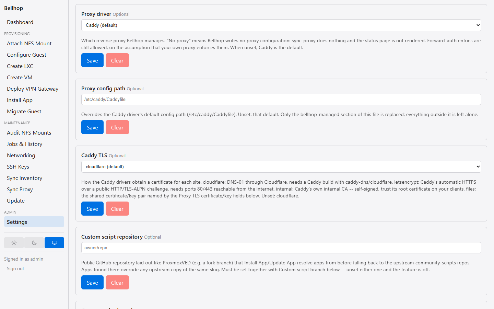

# Reverse proxy drivers

How `sync-proxy` manages a reverse proxy through a driver. Each driver has its
own page:

- [Caddy](caddy.md) — the default.
- [Caddy (admin API)](caddy-api.md) — Caddy configured through its admin
  API instead of a Caddyfile.
- [nginx](nginx.md).
- [Nginx Proxy Manager](nginx-proxy-manager.md).
- [HAProxy](haproxy.md).
- [Traefik](traefik.md).
- "No proxy" (`proxyDriver: none`) — described below.

`sync-proxy` doesn't talk to Caddy (or any other proxy) directly — it goes
through a driver, chosen by the `proxyDriver` setting (see [Inventory-wide
settings](../configuration.md#inventory-wide-settings); unset means
`caddy`, the default; `caddy-api`, `nginx`, `nginx-proxy-manager`,
`haproxy`, `traefik`, and `none` are the other drivers that ship). Exactly
one driver is active per
deployment: it's a per-deployment choice, not a per-entry one, so every
gated/reverse-proxied inventory entry is served by the same proxy. The web
UI's Settings page presents this choice as a dropdown of every driver
Bellhop supports, rather than a free-text field — see [Inventory-wide
settings](../configuration.md#inventory-wide-settings).

A driver declares what it can enforce (`authModes`, e.g. Caddy supports
both `forward` and `oidc`) and whether, for the current settings, it's
issuing TLS certificates via ACME DNS-01 through Cloudflare right now
(`acmeDns01ViaCloudflare(inventory)`, a function rather than a fixed
boolean — both Caddy drivers answer `true` only in their default
`cloudflare` TLS mode, and Traefik answers `true` for any named
certificate resolver but `false` for its reserved `none` value; see the
per-driver TLS options table and "Certificates" below). This is what
gates whether `prune-acme-challenges` runs as part
of the web UI's push-live step — a driver/mode that never touches
Cloudflare's DNS leaves nothing behind for it to clean up. It
implements three operations: `plan()` turns the routes derived from
inventory into a preview and an opaque payload (the dry-run preview is
always exactly what `--apply` sends); `apply()` sends that payload live and
reloads the proxy, throwing on failure — a failed validate or write
restores the proxy's previous configuration rather than leaving it
half-written or silently reporting success. Traefik is the first driver
where reload is a no-op (its file provider hot-reloads on its own) and
where validation itself is optional — see [Traefik](traefik.md#catching-a-rejected-configuration).
`snapshot()` reads back
whatever the proxy currently has deployed, for the status page. Any route
whose auth mode the active driver can't enforce (e.g. a driver with no
`oidc` support and an OIDC-gated entry) is refused at both `sync-proxy` and
guest-edit time, naming the entry, the driver, and the fix — never
silently dropped, which would leave that entry reachable with no gate in
front of it. HAProxy is the first shipped driver that can't enforce every
auth mode (it has no forward-auth, so it accepts OIDC-mode and ungated
entries only), and so the first where this refusal actually happens — see
[HAProxy](haproxy.md#limits).

When the web UI's push-live step (a Dashboard guest edit, or a
provisioning job with subdomains) finds `sync-proxy` failing under any
driver, it still reconciles Authentik, skips the status page render and
the stale ACME-challenge cleanup, and then reports the proxy failure as
before — so one route the proxy keeps refusing never stops Authentik from
being synced for everything else. The CLI's `sync-proxy` still just fails.

**"No proxy" (`proxyDriver: none`) is for an operator whose reverse proxy
is managed by hand, or who has none at all.** It's a real, selectable
driver, not an error state: `sync-proxy` (CLI, web, and MCP alike)
succeeds without making any remote call and reports that Bellhop manages
no reverse proxy, so there is nothing to write — no inventory entry needs
to be flagged `proxy: true` for this to work. It accepts both forward-auth
and OIDC gated entries (capability enforcement never rejects it), on the
assumption that whatever proxy you do run enforces `forward_auth` itself;
`sync-authentik` reconciles Authentik exactly as it does under any other
driver. The standalone `render-status-page` command fails outright under
"No proxy" — there's neither a managed proxy nor a document root to serve
a page from — naming `proxyDriver` as the setting to change; the web UI's
combined push-live step and `migrate-guest`'s post-move push log the same
"nothing to write" line in place of the proxy push, then skip the status
page render with one log line and continue, the same opt-in
skip they already give an unset `statusPagePath`. The stale ACME-challenge
cleanup is skipped too, through the same driver-capability check that
skips it for any driver/mode combination not currently issuing
certificates via Cloudflare DNS-01 (nginx, Nginx Proxy Manager, and
HAProxy always; both Caddy drivers whenever their Caddy TLS mode isn't
`cloudflare`; Traefik whenever its certificate resolver is `none`).

A driver that's configured through a file (Caddy, nginx, HAProxy, and
Traefik all are; the REST-managed Caddy admin-API and Nginx Proxy Manager
drivers are not) is built with a shared `fileDriver` helper: it backs up the
target file(s), writes the new content in place (either replacing a
managed section while leaving everything else on the file untouched, or
replacing a file Bellhop owns outright), runs the proxy's own validation
command against the real path, restores every backup and fails if
validation fails, and reloads the proxy otherwise. HAProxy is the first to
own two files — its backends file and the `bellhop.map` beside it — backed
up, written, validated, and restored together as one unit; its dry-run
preview labels each file with a `==> <path> <==` line. Traefik is the
first driver whose validate command and reload command can both be
absent (`null`): validation runs only when `proxyApiUrl` is set, and
there is never a reload line, since Traefik's file provider reloads on
its own the moment the write lands — that write itself is also the first
to ask for an atomic, same-directory rename rather than an in-place
truncate, since Traefik's watcher could otherwise observe a half-written
file (see [Traefik](traefik.md)). Nginx Proxy Manager is the first driver
that manages a real proxy with *no* configuration file at all — it
reconciles proxy hosts over NPM's own REST API instead (see [Nginx Proxy
Manager](nginx-proxy-manager.md)), and the [Caddy admin-API
driver](caddy-api.md) likewise reconciles tagged objects in Caddy's live
configuration, so a driver's config path is now
`string | null`: `null` means "this driver has no file," and the Settings
page hides the Proxy config path field entirely for it rather than
showing it empty. Each managed driver must still state its
Settings-dropdown label and whether it serves a status page; neither has
a default. A driver that manages a proxy but serves no status page makes
`render-status-page` fail with a message saying to clear `statusPagePath`
or pick another driver, and the push-live step logs a warning, not an
info line, when `statusPagePath` is set but ignored.

On both drivers that write a file and support forward-auth (Caddy and
nginx), a request to a forward-gated entry's exempt
(`unauthenticatedPaths`) location skips the Authentik check entirely — any
`X-authentik-*` identity headers on that request are whatever the client
itself sent, unverified, so a backend must not trust them on an exempt
path the way it can trust them everywhere else on a gated site.

**Certificates are the operator's job for a driver that doesn't issue them
itself, and even Caddy's own DNS-01 issuance is now one choice among
several (issue #51).** Caddy's `proxyCaddyTls` setting (unset means
`cloudflare`, today's original behaviour — see
[Inventory-wide settings](../configuration.md#inventory-wide-settings))
picks how *both* Caddy drivers obtain a certificate per site: Cloudflare
DNS-01 with no extra setup beyond a Caddy build carrying the Cloudflare DNS
module; a public Let's Encrypt HTTP-01/TLS-ALPN-01 challenge through
Caddy's own automatic HTTPS, needing no DNS provider but needing ports
80/443 reachable from the internet; Caddy's internal (self-signed) CA,
needing nothing public at all but needing that CA trusted on every client
that connects; or the same shared certificate/key file pair the nginx
driver uses. Switching modes needs only the setting change and one sync —
see [Caddy driver](caddy.md#certificate-modes). Traefik can also obtain its
own certificates, but — unlike Caddy — through a certificate resolver you
define yourself in its static configuration (Bellhop only names it on each
router; see [Traefik](traefik.md#prerequisites-the-static-configuration-you-own)),
or through `proxyCertResolver: none` to enable TLS with no resolver at all
and let Traefik's file provider or default certificate serve it instead —
see [Traefik](traefik.md#certificate-resolver). nginx cannot obtain its own
certificate, so every site the nginx driver
generates shares one certificate/key pair instead — see [nginx
driver](nginx.md). Nginx Proxy Manager sits in between: it reuses a
covering certificate already in NPM (a self-signed one works as well as a
Let's Encrypt one — see [Nginx Proxy Manager](nginx-proxy-manager.md#certificates)),
and otherwise has NPM request one over its own HTTP-01
challenge — see [Nginx Proxy Manager](nginx-proxy-manager.md) for what
that requires. HAProxy needs the same kind of operator-managed certificate tool
(`certbot`, `acme.sh`, or a self-signed `openssl` certificate) running
alongside it, filling the certificate
directory your own frontend's `bind … ssl crt` names — see [HAProxy
driver](haproxy.md#prerequisites). Bellhop itself never issues or renews a
certificate.

**Per driver, a Let's Encrypt route that doesn't need Cloudflare, and a
self-signed route** (issue #51 — every driver's own page documents both in
full, and a future driver's page must too):

| Driver | Let's Encrypt without Cloudflare | Self-signed |
|---|---|---|
| Caddy / Caddy (admin API) | `proxyCaddyTls: letsencrypt` — Caddy's own HTTP-01/TLS-ALPN-01, ports 80/443 reachable from the internet | `proxyCaddyTls: internal` — Caddy's own internal CA |
| nginx | `certbot --webroot`/`--standalone`, pointed at `proxyTlsCertificate`/`proxyTlsKey` | `openssl req -x509`, pointed at the same two settings |
| Nginx Proxy Manager | its own built-in HTTP-01 request (the default when no covering certificate exists) | an uploaded self-signed certificate covering the route's hostnames |
| HAProxy | `certbot`/`acme.sh` (HTTP-01), writing into the frontend's own certificate directory | an `openssl`-generated PEM in the same directory |
| Traefik | an HTTP-01 resolver in static configuration (`certificatesResolvers.<name>.acme.httpChallenge`) | `proxyCertResolver: none` plus a certificate loaded through the file provider, or Traefik's own default certificate |
| None | n/a — Bellhop manages no proxy | n/a |

## Upgrading from the Caddy-only version

**Upgrading an existing installation needs no manual steps in most
cases.** An inventory created by an older version upgrades itself
automatically the first time it's opened by the new code — pull the new
code and restart the service, and the upgrade never repeats. Caddy is
chosen as the driver by default, so the reverse-proxy configuration a
`sync-proxy --apply` produces afterward is unchanged from before the
upgrade. The renamed command was `sync-caddy` and the renamed inventory
flags were `caddy`/`caddyManual`; none of the old names still work, and
`import-yaml-inventory` refuses a `hosts.yaml` that still uses the old
flags until they are renamed to `proxy`/`proxyManual`. Two cases do need
a step by hand:

- **You set `CADDYFILE_PATH`.** That environment variable is gone and is
  no longer read. If you pointed it anywhere other than
  `/etc/caddy/Caddyfile`, run
  `bellhop set-config proxyConfigPath <path> --apply` with the same path.
- **An `unauthenticatedPaths` value is not an exact path or a `/*`
  prefix.** Each value must now be an exact path (`/health`) or a path
  ending in `/*` (`/api/*`); anything else (`/api*`, `/a*b`) makes the
  inventory refuse to load until that value is edited to one of those
  two forms. Since nothing can load the inventory meanwhile, edit it in
  `inventory/bellhop.db` directly: the `unauthenticated_paths_json`
  column of whichever `hosts`, `guests`, or `external_sites` row holds
  it.
