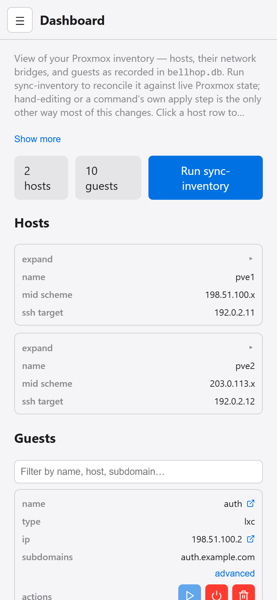
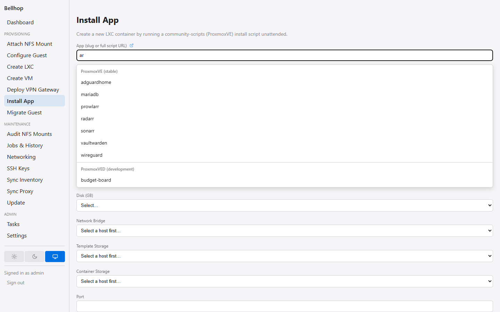
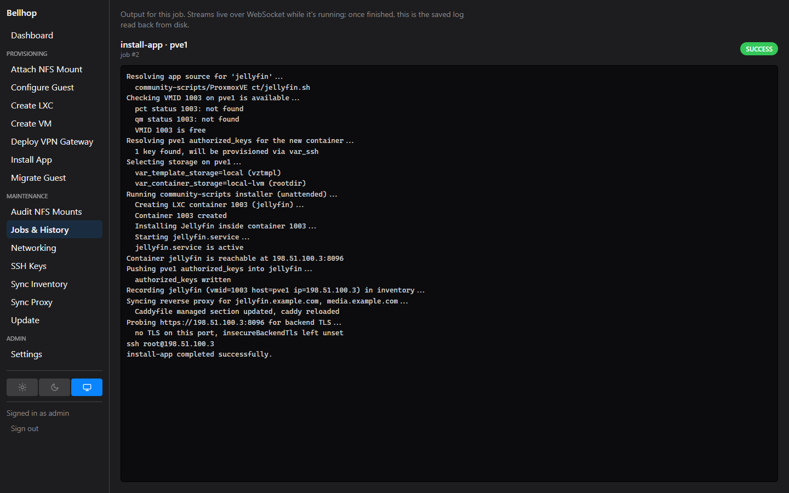
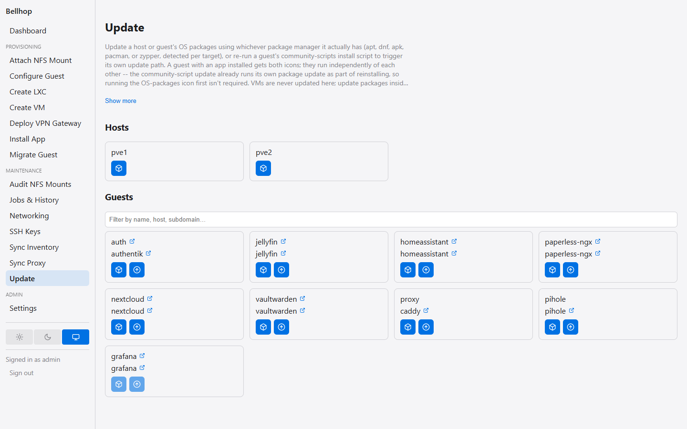

# Web UI

A browser dashboard for everything in [Commands](commands.md), instead of
the CLI:

```bash
npm run web:dev                   # dev server: API on :3001, Vite dev server with hot-reload
npm run web:build                 # production build of web-client/dist
npm run web:start                 # production: one Express server serving both the API and the built UI, on :3001
```

`src/web/server.ts` is a single Express process that's both the backend
*and* the frontend in production (`web:start`) — it mounts every
`/api/*` route (dashboard, jobs, provisioning, maintenance) and serves
`web-client/dist`'s built static files with a catch-all fallback to
`index.html`. Only `web:dev` runs a separate frontend process (Vite's dev
server, for hot-reload), proxying API calls to the same backend.

## Demo

```bash
npm run web:build
npm run demo
```

Prints `Bellhop demo running at http://127.0.0.1:3100 -- example data only,
nothing reaches a real host. Press Ctrl+C to stop.` and serves the same web
UI against a throwaway, fully populated example inventory — two Proxmox
hosts, a handful of guests in various states, four job-history entries, and
a signed-in `admin` user — with no Proxmox host, Authentik instance, or SSH
key required. Every write (a guest edit, an install-app run, a settings
change) lands only in a temporary directory that `Ctrl+C` removes along with
the server; the repository's own inventory and `data/` are never read or
written. Stopping and starting it again always comes back to the same
starting data. To run it on a port other than `3100`, set `PORT` to another
port: `PORT=3200 npm run demo` in a POSIX shell, or `$env:PORT=3200; npm run demo`
in PowerShell.

The Dashboard shows inventory (hosts, guests, bridges, storages). Each guest
row has its own Start/Shutdown icon buttons (`guest-power` under the hood)
for one-off actions without opening a form. A guest row's Advanced link
opens a modal with its less-common fields (auth group, unauthenticated
paths, vpn, and the rest); each one has an ⓘ next to its label with a
one-to-two-sentence explanation, reachable by hover, tap or keyboard.

On a phone-width screen (640px or narrower) the sidebar folds into a menu
button and every table becomes a stack of cards, one per row, each value
labelled with its column name:



Provisioning actions (create-lxc/create-vm/install-app/deploy-vpn-gateway/
delete-guest/migrate-guest/attach-nfs-mount/migrate-nfs-mount) and
maintenance actions (sync-inventory) run from forms instead of flags. The
Install App form's App field suggests community-scripts apps as you type,
grouped by repository:



Every action streams its live log via WebSocket on a Job page, and every job
also lands in Job History afterward:



Updating apt packages and community-script apps has its own dedicated
`/update` page instead, showing a card per host/guest with an apt-update
icon and, for guests with an app installed, a second community-script-update
icon:



Changes that touch
subdomains (a new guest's Subdomains field, editing an existing guest's
subdomains, deleting a guest that had any) automatically re-run
`sync-proxy` and `render-status-page` in the same job, so the live
proxy configuration and status page never drift from what the Dashboard
shows. Set `PORT` to run it on a port other than 3001.

The deployed web UI can be gated behind Caddy's `forward_auth`, checking
every request against a self-hosted Authentik instance and forwarding
trusted `X-authentik-*` identity headers on success — there is no login
page or session store in this app itself, only a global Express middleware
(`src/web/auth.ts`) that trusts those headers when present. Whether a
request arriving with no such headers is rejected or served as a synthetic
always-admin local operator is controlled by `WEB_UI_AUTH_MODE` (see
[Environment variables](environment-variables.md) and
[Running without Authentik](authentik.md#running-without-authentik)).
The default `auto` mode falls back to the local operator, so running
`web:start`/`web:dev` directly (not routed through Caddy) works out of the
box instead of 401ing the whole dashboard; set `WEB_UI_AUTH_MODE=authentik`
on any deployment where authentication is load-bearing to get the old,
fail-closed behavior back. `WEB_UI_DEV_USER` remains useful in dev/test for
simulating a *specific non-admin group membership*, which the synthetic
local operator can't do — `web:dev` sets it automatically (to `local-dev`)
and `npm test` sets it too (to `test-user`).

## Screenshots

The images on this page and in `README.md`/`docs/authentik.md`/
`docs/reverse-proxy/README.md` are captured from a throwaway demo instance,
not a real deployment. Regenerate all of them with:

```bash
npm run web:build
npm run docs:screenshots
```

This needs Google Chrome or Microsoft Edge installed (it also works with
Playwright's own bundled Chromium after `npx playwright install chromium`).
It writes every file under `docs/images/` and prints one `wrote
docs/images/<file>` line per image; after a UI change that alters a
screenshotted screen, regenerate and check the new images by eye for
example-only values before committing them.
